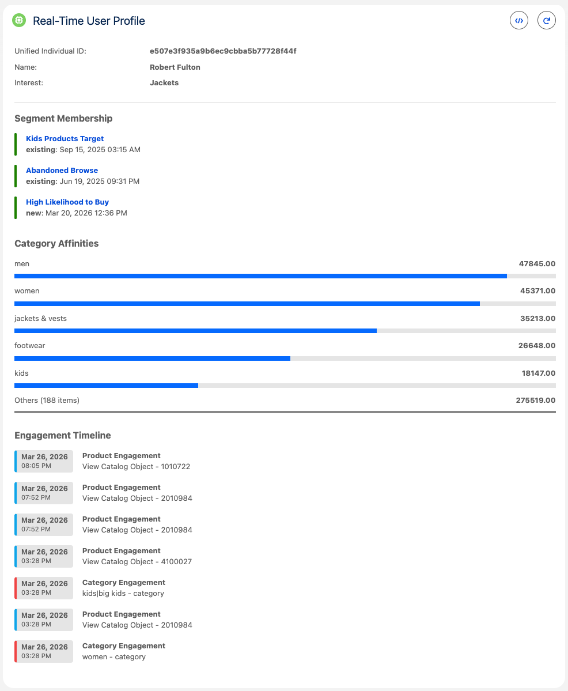
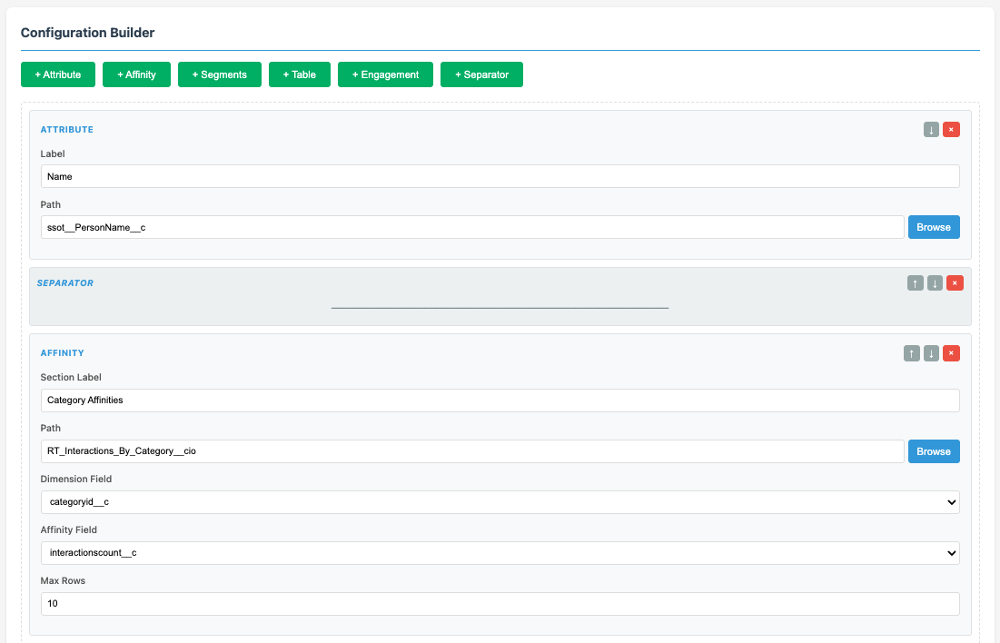
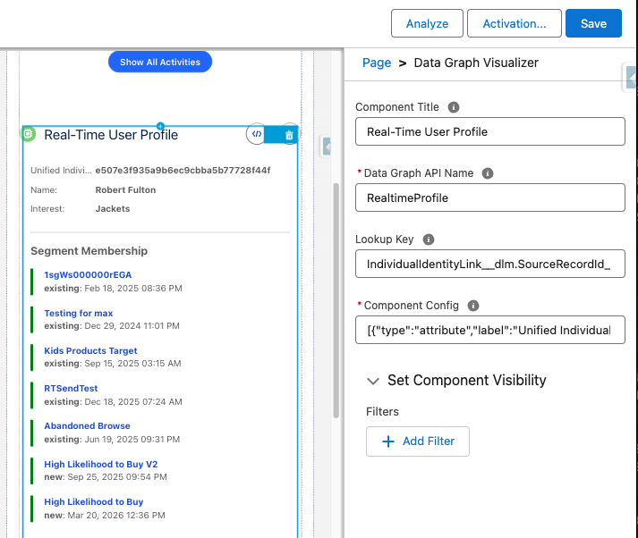
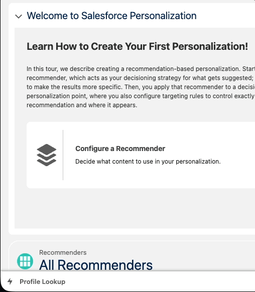

# Salesforce Data Cloud Data Graph Visualizer

This Salesforce DX project provides a Real-Time Data Graph (RTDG) visualizer component and related utilities for Salesforce orgs. 

## Disclamer
This is a private open source project. It is not an offical feature of Salesforce Data Cloud. 

## This components supports visualizing:
   - Direct attributes
   - Segment Membership
   - Calculated Insightes as Affinities
   - Engagement DMOs
   - Tabular data from CIs or DMOs

## Installation

Follow these detailed steps to install this project on your Salesforce org:

1. **Prerequisites**:
   - Ensure you have Node.js installed (version 14 or later).
   - Install the Salesforce CLI by running: `npm install -g @salesforce/cli`
   - Set up a Salesforce Developer Edition org or use an existing sandbox/production org.
   - Create a Profile Data Graph and make sure that all properties you would like to visualize are available there
   - Make sure that identity resolution rules are configured
   - If you are plannning to use this component on a record page, eg: Contact Record Page, make sure that Contact records are sent to Data Cloud and that Identity Resolution Rules are configured for those records

2. **Clone or Download the Project**:
   - Clone this repository to your local machine: `git clone https://github.com/Bizcuit/rtdg_visualizer.git`
   - Or download the ZIP file and extract it to a local directory.

3. **Navigate to the Project Directory**:
   - Open a terminal and change to the project directory: `cd rtdg_visualizer`

4. **Install Dependencies**:
   - Run `npm install` to install any Node.js dependencies (if applicable, based on package.json).

5. **Authorize Your Org**:
   - Authenticate with your Salesforce org: `sf org login web --alias myorg`
   - Replace `myorg` with a suitable alias for your org.

6. **Deploy the Source Code**:
   - Deploy all components to your org: `sf project deploy start`
   - Alternatively, deploy specific metadata: `sf project deploy start --source-dir force-app`

7. **Assign Permissions**:
   - Ensure users have the necessary permissions to access the LWC and Flows. This may involve creating permission sets or profiles with access to custom objects, Apex classes, and Lightning components.

8. **Configure the Component**:
    - Add the `rtdgVisualizer` LWC to a Lightning page or app in your org via the Lightning App Builder and open comopnent properties
    - Set the mandotory value of the "Data Graph API Name" parameter. Component will visualize data from this data graph
    - Check and (if required) modify the "Lookup Key" parameter. The value of this parameter depends on the identidy resolution rules you have configured. The standard OOTB value for this paramter is "IndividualIdentityLink__dlm.SourceRecordId__c=RECORD_ID" which should work with standard IR rules that were defined without additional Prefixes in Data Cloud. "RECORD_ID" substring is automatically replaced with the current record ID of the current page.
    - Set mandatory value of the "Components Config" parameter. The value for this parameter is a JSON object. Use [Configurator App](https://bizcuit.github.io/rtdg_visualizer/index.html) to generate the value for this parameter.
    - Optionaly set the value of the "Component Title" parameter

9. **Verify Installation**:
    - Log in to your Salesforce org and navigate to the page where the visualizer is embedded.
    - Test the functionality by interacting with the data graph visualization.

For more information, refer to the [Salesforce DX Developer Guide](https://developer.salesforce.com/docs/atlas.en-us.sfdx_dev.meta/sfdx_dev).

## Configuration Builder Tool

### What is the Config Builder?

The Config Builder is a visual web-based tool (`index.html`) that helps you create the JSON configuration required by the rtdgVisualizer component. Instead of manually writing JSON, you can use this tool to visually build your configuration with an intuitive drag-and-drop interface.

**Access the tool**: Open `index.html` in your browser, or use the hosted version at [https://bizcuit.github.io/rtdg_visualizer/](https://bizcuit.github.io/rtdg_visualizer/)

### How to Use the Config Builder

#### Step 1: Load Your Data Graph Schema

1. **Get the Data Graph Preview**:
   - In Salesforce, go to **Data Cloud → Data Graphs**
   - Select your Data Graph and click **Preview**
   - Copy the entire JSON-like output from the preview results

2. **Paste the Schema**:
   - In the Config Builder, paste the JSON into the "Input Schema: Data Graph Preview" textarea
   - Click **Load Schema**
   - The schema panel will collapse, confirming the schema was loaded successfully

#### Step 2: Build Your Configuration

Add configuration items using the buttons provided. Each item type serves a different purpose:

**Available Configuration Types**:

- **Attribute**: Display a single field from your Data Graph
  - **Label**: The display name for this attribute
  - **Path**: The field path in the Data Graph (use Browse to select)
  - *Example*: Display a person's name or email address

- **Affinity**: Visualize Calculated Insights as affinity scores by dimension
  - **Section Label**: Title for this section
  - **Path**: Path to the Calculated Insight representing affinity data
  - **Dimension Field**: Field containing the dimension name (e.g., "Category__c")
  - **Affinity Field**: Field containing the metric value / affinity (e.g., "Affinity__c")
  - **Max Rows**: Maximum number of dimensions to display
  - *Example*: Show top 10 product categories by affinity score

- **Segments**: Display Data Cloud segments that the individual belongs to
  - **Section Label**: Title for this section
  - **Path**: Path to the segments array
  - *Example*: Show which audience segments the person is in

- **Table**: Display tabular data from arrays in your Data Graph
  - **Section Label**: Title for this section
  - **Path**: Path to the array of data
  - **Columns**: Define each column with a label and property name
  - *Example*: Display a list of orders with date, amount, and status

- **Engagement**: Visualize engagement Data Model Objects (DMOs) as a timeline
  - **Max Rows**: Maximum number of engagement records to display
  - **Items**: Add multiple engagement types (e.g., Email Opens, Page Views, Product Views)
    - **Label**: Display name for this engagement type
    - **Color**: Visual color for this engagement type (choose from palette)
    - **Path**: Path to the engagement DMO array (e.g., Product Browse Engagement)
    - **Fields**: Map the timestamp, title, and detail fields
  - *Example*: Show email opens, clicks, and website visits on a timeline

- **Separator**: Add a visual divider between sections

#### Step 3: Configure Each Item

1. **Use the Browse Button**: Click "Browse" next to any path field to open an interactive tree view of your Data Graph schema
   - Search for fields using the search box
   - Click to expand/collapse nodes
   - Select a path and click "Select"

2. **Fill in Field Details**: For items like Affinity, Table, and Engagement, you'll need to specify which fields to display
   - The tool automatically detects available fields based on the path you selected
   - Use dropdowns to select fields when available

3. **Reorder Items**: Use the up/down arrows or drag-and-drop to reorder your configuration items

#### Step 4: Export Configuration

1. **Review Output**: The "Output JSON" panel shows your configuration in real-time
2. **Copy to Clipboard**: Click "Copy to Clipboard" to get minified JSON ready for Salesforce
3. **Download JSON**: Click "Download JSON" to save the configuration file
4. **Paste into Component**: Use the copied JSON as the value for the "Component Config" parameter in your rtdgVisualizer component

### Tips for Using the Config Builder

- **Start with the schema**: Always load your Data Graph schema first before adding configuration items
- **Use Browse for accuracy**: The Browse button helps you avoid typos in field paths
- **Test incrementally**: Build and test your configuration with one or two items first, then add more
- **Save your work**: Download your JSON configuration so you can import it later if needed
- **Reuse configurations**: Import previously saved configurations using the "Import JSON" button

## Usage Instructions

### Adding rtdgVisualizer to Contact or Lead Record Pages

Follow these steps to add the Data Graph Visualizer to Contact or Lead record pages:

1. **Navigate to Setup**:
   - Log in to your Salesforce org
   - Click on the gear icon (Setup) in the top right corner

2. **Open Lightning App Builder**:
   - In Quick Find, search for "Lightning App Builder"
   - Click on "Lightning App Builder"

3. **Edit the Record Page**:
   - For Contact: Find "Contact Record Page" and click "Edit"
   - For Lead: Find "Lead Record Page" and click "Edit"
   - If you have multiple record pages, select the one you want to modify

4. **Add the Component**:
   - In the left sidebar, find the "Custom" components section
   - Locate "Data Graph Visualizer" component
   - Drag and drop it onto your desired location on the page (recommended: a new tab or prominent section)

5. **Configure Component Properties**:
   - With the component selected, configure the following in the right panel:
     - **Component Title**: Enter a title (e.g., "Real-Time Profile")
     - **Data Graph API Name**: Enter your Profile Data Graph API name (required)
     - **Lookup Key**: Default value is `IndividualIdentityLink__dlm.SourceRecordId__c=RECORD_ID`
       - Modify if your Identity Resolution rules use custom prefixes
       - `RECORD_ID` will be automatically replaced with the current Contact/Lead record ID
     - **Component Config**: Paste the JSON configuration generated from the [Configurator App](https://bizcuit.github.io/rtdg_visualizer/index.html) (required)

6. **Save and Activate**:
   - Click "Save"
   - Click "Activate" (or "Save as the org default" if already activated)
   - Choose activation options:
     - For specific apps: Select the apps where this page should be active
     - For specific profiles: Assign to specific user profiles
     - Click "Save"

7. **Test the Component**:
   - Navigate to any Contact or Lead record
   - Verify that the visualizer displays the Data Graph information
   - Click the refresh button to reload data if needed

### Adding rtdgVisualizerUtilityBar as a Utility Bar Item

The Utility Bar version allows users to look up any Individual's data graph without being on a specific record page. Follow these steps to add it to an app (example: "Personalization" app):

1. **Navigate to App Manager**:
   - Go to Setup
   - In Quick Find, search for "App Manager"
   - Click on "App Manager"

2. **Edit Your Lightning App**:
   - Find the app where you want to add the utility item (e.g., "Personalization")
   - Click the dropdown arrow next to the app name
   - Select "Edit"

3. **Navigate to Utility Items**:
   - In the app setup screen, click on "Utility Items" in the left navigation menu
   - Click "Add Utility Item"

4. **Select the Component**:
   - In the dropdown, select "Data Graph Visualizer - Utility Bar"
   - Click "OK" or "Add"

5. **Configure Component Properties**:
   - **Label**: Enter a user-friendly label (e.g., "Profile Lookup")
   - **Icon**: Choose an icon (e.g., "people")
   - **Width**: Set to **480** (recommended for optimal display)
   - **Height**: Set to 480 or adjust based on your needs
   - **Data Graph API Name**: Enter your Profile Data Graph API name (required)
   - **Lookup Key**: Default value is `IndividualIdentityLink__dlm.SourceRecordId__c=RECORD_ID`
     - `RECORD_ID` will be replaced with the Individual ID entered by the user
   - **Component Config**: Paste the JSON configuration from the [Configurator App](https://bizcuit.github.io/rtdg_visualizer/index.html) (required)

6. **Optional Settings**:
   - **Start automatically**: Toggle if you want the utility to open automatically when the app loads
   - **Show in console navigation**: Enable if you want it visible in console apps

7. **Save the App**:
   - Click "Save" to save your changes

8. **Test the Utility Item**:
   - Navigate to the app where you added the utility (e.g., "Personalization")
   - Look for the utility bar at the bottom of the screen
   - Click on your new utility item (e.g., "Individual Lookup")
   - The utility panel will open, prompting you to enter an Individual ID
   - Enter a valid Individual ID and click "Lookup Individual"
   - The Data Graph visualization will display
   - Use the back button to change the Individual ID if needed

**Note**: The recommended width of **480 pixels** ensures that the component has enough space to display data graphs without horizontal scrolling while maintaining a comfortable utility bar experience.

## Package Contents

The following objects are included in this package:

### Apex Classes
- **DataCloudSegmentHelper.cls**: Provides helper methods for managing Data Cloud segments, enabling data segmentation and filtering capabilities within the visualizer.
- **DataGraphHelper.cls**: Contains utility functions for handling Data Graph operations, such as querying and processing graph data structures.
- **FlowExecutionController.cls**: Acts as a controller for executing Salesforce Flows, facilitating automated processes triggered by the visualizer.

### Flows
- **dgLookup.flow**: A Salesforce Flow that performs lookups on Data Graphs, allowing users to search and retrieve graph-related data interactively.

### Lightning Web Components (LWCs)
- **rtdgVisualizer**: The main Lightning Web Component that renders the Real-Time Data Graph visualization, including HTML template, JavaScript logic, CSS styling, and metadata configuration. This component is essential for displaying interactive data graphs in Lightning pages.
- **rtdgVisualizerUtilityBar**: A utility bar wrapper component that prompts users to enter an Individual ID before displaying the Data Graph visualization. Designed specifically for use in the Lightning Utility Bar, allowing users to look up any individual's profile data without being on a specific record page.

### Configuration Files
- **project-scratch-def.json**: Defines the scratch org configuration, specifying features, settings, and data required for development and testing environments.
