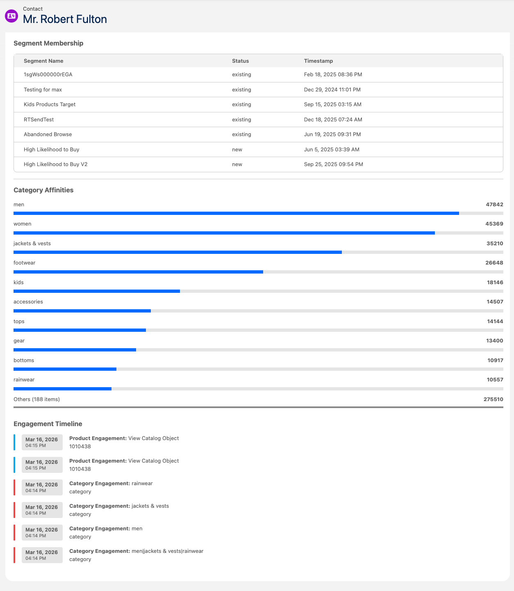

# Salesforce Data Cloud Data Graph Visualizer

This Salesforce DX project provides a Real-Time Data Graph (RTDG) visualizer component and related utilities for Salesforce orgs. 

## Disclamer
This is an open source product that is not an offical feature of Salesforce Data Cloud. 

## This components supports visualizing:
   - Direct attributes
   - Calculated Insightes as Affinities
   - Engagement DMOs
   - Tabular data from CIs or DMOs

## Installation

Follow these detailed steps to install this project on your Salesforce org:

1. **Prerequisites**:
   - Ensure you have Node.js installed (version 14 or later).
   - Install the Salesforce CLI by running: `npm install -g @salesforce/cli`
   - Set up a Salesforce Developer Edition org or use an existing sandbox/production org.
   - Create a Profile Data Graph and make sure that all properties you would like to visualize are available there
   - Make sure that identity resolution rules are configured
   - If you are plannning to use this component on a record page, eg: Contact Record Page, make sure that Contact records are sent to Data Cloud and that Identity Resolution Rules are configured for those records

2. **Clone or Download the Project**:
   - Clone this repository to your local machine: `git clone https://github.com/Bizcuit/rtdg_visualizer.git`
   - Or download the ZIP file and extract it to a local directory.

3. **Navigate to the Project Directory**:
   - Open a terminal and change to the project directory: `cd rtdg_visualizer`

4. **Install Dependencies**:
   - Run `npm install` to install any Node.js dependencies (if applicable, based on package.json).

5. **Authorize Your Org**:
   - Authenticate with your Salesforce org: `sf org login web --alias myorg`
   - Replace `myorg` with a suitable alias for your org.

6. **Deploy the Source Code**:
   - Deploy all components to your org: `sf project deploy start`
   - Alternatively, deploy specific metadata: `sf project deploy start --source-dir force-app`

7. **Assign Permissions**:
   - Ensure users have the necessary permissions to access the LWC and Flows. This may involve creating permission sets or profiles with access to custom objects, Apex classes, and Lightning components.

8. **Configure the Component**:
    - Add the `rtdgVisualizer` LWC to a Lightning page or app in your org via the Lightning App Builder and open comopnent properties
    - Set the mandotory value of the "Data Graph API Name" parameter. Component will visualize data from this data graph
    - Check and (if required) modify the "Lookup Key" parameter. The value of this parameter depends on the identidy resolution rules you have configured. The standard OOTB value for this paramter is "IndividualIdentityLink__dlm.SourceRecordId__c=RECORD_ID" which should work with standard IR rules that were defined without additional Prefixes in Data Cloud. "RECORD_ID" substring is automatically replaced with the current record ID of the current page.
    - Set mandatory value of the "Components Config" parameter. The value for this parameter is a JSON object. Use [Configurator App](https://bizcuit.github.io/rtdg_visualizer/index.html) to generate the value for this parameter.
    - Optionaly set the value of the "Component Title" parameter

9. **Verify Installation**:
    - Log in to your Salesforce org and navigate to the page where the visualizer is embedded.
    - Test the functionality by interacting with the data graph visualization.

For more information, refer to the [Salesforce DX Developer Guide](https://developer.salesforce.com/docs/atlas.en-us.sfdx_dev.meta/sfdx_dev).

## Package Contents

The following objects are included in this package:

### Apex Classes
- **DataCloudSegmentHelper.cls**: Provides helper methods for managing Data Cloud segments, enabling data segmentation and filtering capabilities within the visualizer.
- **DataGraphHelper.cls**: Contains utility functions for handling Data Graph operations, such as querying and processing graph data structures.
- **DataGraphPicklist.cls**: Manages picklist values related to Data Graphs, ensuring consistent data selection options in flows and components.
- **FlowExecutionController.cls**: Acts as a controller for executing Salesforce Flows, facilitating automated processes triggered by the visualizer.
- **FlowPicklist.cls**: Handles picklist configurations for Flows, supporting dynamic flow selections based on user inputs.

### Flows
- **dgLookup.flow**: A Salesforce Flow that performs lookups on Data Graphs, allowing users to search and retrieve graph-related data interactively.

### Lightning Web Components (LWCs)
- **rtdgVisualizer**: The main Lightning Web Component that renders the Real-Time Data Graph visualization, including HTML template, JavaScript logic, CSS styling, and metadata configuration. This component is essential for displaying interactive data graphs in Lightning pages.

### Configuration Files
- **project-scratch-def.json**: Defines the scratch org configuration, specifying features, settings, and data required for development and testing environments.
